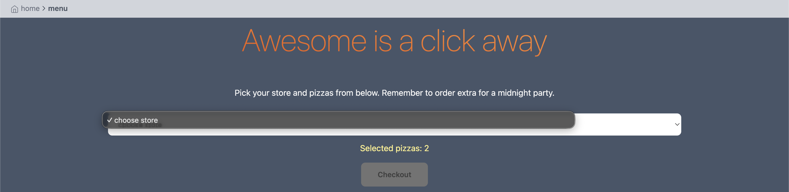
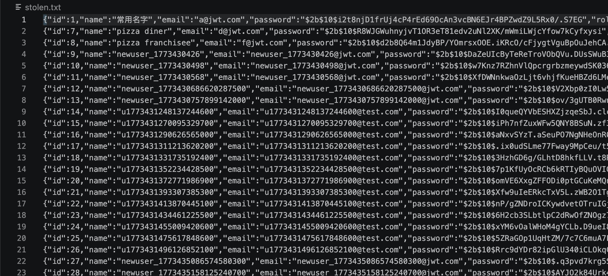
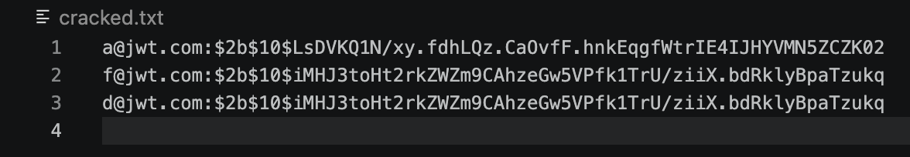
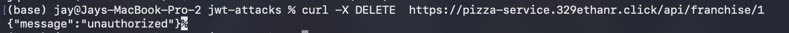
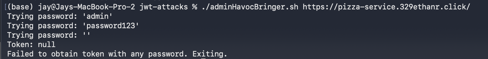

# Attacks on self

### Attack 1
| Franchise Killer           | Result                                                                         |
| -------------- | ------------------------------------------------------------------------------ |
| Date           | April 6, 2026                                                                  |
| Target         | pizza.jays-jwt-pizza.click                                                       |
| Classification | Broken Access Control                                                                      |
| Severity       | 0 (would be 1 if we hadn't fixed this already.)                                                                              |
| Description    | Removes all franchises removing the ability to buy pizzas             |
| Images         |    Stores and menu no longer accessible. |
| Corrections    | Check auth before allowing franchise deletion.

### Attack 2
| Admin Havoc           | Result                                                                         |
| -------------- | ------------------------------------------------------------------------------ |
| Date           | April 6, 2026                                                                  |
| Target         | pizza.jays-jwt-pizza.click                                                       |
| Classification | Security Misconfiguration                                                                 |
| Severity       | 0 (would be 4 if we hadn't fixed this already.)                                                                              |
| Description    | Removes all franchises removing the ability to buy pizzas. Also steals all users information and deletes all users.             |
| Images         |    Stolen User info |
| Corrections    | Change default admin password. Even better: have secure admin password.

### Attack 3
| Nasty SQL           | Result                                                                         |
| -------------- | ------------------------------------------------------------------------------ |
| Date           | April 6, 2026                                                                  |
| Target         | pizza.jays-jwt-pizza.click                                                       |
| Classification | Injection                                                                |
| Severity       | 4                                                                           |
| Description    | Steals all user's emails and the original hashed passwords. Then it sets everyone's password to the latest special secret password.            |
| Images         |    Stolen User info |
| Corrections    | Fix SQL injection in updating user data.

### Attack 4
| Empty Password/common passwords           | Result                                                                         |
| -------------- | ------------------------------------------------------------------------------ |
| Date           | April 9, 2026                                                                  |
| Target         | pizza.jays-jwt-pizza.click                                                       |
| Classification | Security Misconfiguraition                                                                |
| Severity       | 0 (would be 4 if not fixed)                                                                           |
| Description    | Removes all franchises removing the ability to buy pizzas. Also steals all users information and deletes all users.         |
| Images         |    Attack Failed |
| Corrections    | Fix SQL injection in updating user data.

### Attack 5
| DOS           | Result                                                                         |
| -------------- | ------------------------------------------------------------------------------ |
| Date           | April 9, 2026                                                                  |
| Target         | pizza.jays-jwt-pizza.click                                                       |
| Classification | Insecure Design                                                             |
| Severity       | 3                                                                         |
| Description    | Makes a bunch of factory API calls to generate huge latency. Also can just break with regular DOS stuff.   |
| Images         |    Yeah we broke |
| Corrections    | Cap pizza purchases to 19. Or find a way to make factory calls in parts. Throttle requests.

# Attacks on Ethan

### Attack 1
| Franchise Killer           | Result                                                                         |
| -------------- | ------------------------------------------------------------------------------ |
| Date           | April 6, 2026                                                                  |
| Target         | https://pizza.329ethanr.click/                                                      |
| Classification | Broken Access Control                                                                      |
| Severity       | 0                                                                        |
| Description    | Removes all franchises removing the ability to buy pizzas             |
| Images         | |
| Corrections    | Check auth before allowing franchise deletion.

### Attack 2
| Admin Havoc           | Result                                                                         |
| -------------- | ------------------------------------------------------------------------------ |
| Date           | April 6, 2026                                                                  |
| Target         | https://pizza.329ethanr.click/                                                      |
| Classification | Security Misconfiguration                                                                 |
| Severity       | 0                                                                       |
| Description    | Removes all franchises removing the ability to buy pizzas. Also steals all users information and deletes all users.             |
| Images         | |
| Corrections    | Change default admin password. Even better: have secure admin password.

### Attack 3
| Nasty SQL           | Result                                                                         |
| -------------- | ------------------------------------------------------------------------------ |
| Date           | April 6, 2026                                                                  |
| Target         | https://pizza.329ethanr.click/                                                      |
| Classification | Injection                                                                |
| Severity       | 0                                                                       |
| Description    | Steals all user's emails and the original hashed passwords. Then it sets everyone's password to the latest special secret password.            |
| Images         | |
| Corrections    | Fix SQL injection in updating user data.

### Attack 4
| Empty Password/common passwords           | Result                                                                         |
| -------------- | ------------------------------------------------------------------------------ |
| Date           | April 9, 2026                                                                  |
| Target         | https://pizza.329ethanr.click/                                                      |
| Classification | Security Misconfiguraition                                                                |
| Severity       | 0                                                           |
| Description    | Removes all franchises removing the ability to buy pizzas. Also steals all users information and deletes all users.         |
| Images         | |
| Corrections    | Fix SQL injection in updating user data.

### Attack 5
| DOS          | Result                                                                         |
| -------------- | ------------------------------------------------------------------------------ |
| Date           | April 9, 2026                                                                  |
| Target         | https://pizza.329ethanr.click/                                                    |
| Classification | Insecure Design                                                             |
| Severity       | 0                                                                         |
| Description    | Makes a bunch of factory API calls to generate huge latency. Also can just break with regular DOS stuff.   |
| Images         |    Yeah we broke |
| Corrections    | Cap pizza purchases to 19. Or find a way to make factory calls in parts. Throttle requests.