# **__Penetration Testing__**

# Attacks on Jay

## Self-attacks

### Attack 1

| Franchise Killer | Result                                                                                        |
|------------------|-----------------------------------------------------------------------------------------------|
| Date             | April 6, 2026                                                                                 |
| Target           | pizza.jays-jwt-pizza.click                                                                    |
| Classification   | Broken Access Control                                                                         |
| Severity         | 0 (would be 1 if we hadn't fixed this already.)                                               |
| Description      | Removes all franchises removing the ability to buy pizzas                                     |
| Images           |    Stores and menu no longer accessible. |
| Corrections      | Check auth before allowing franchise deletion.                                                |

### Attack 2

| Admin Havoc    | Result                                                                                                              |
|----------------|---------------------------------------------------------------------------------------------------------------------|
| Date           | April 6, 2026                                                                                                       |
| Target         | pizza.jays-jwt-pizza.click                                                                                          |
| Classification | Security Misconfiguration                                                                                           |
| Severity       | 0 (would be 4 if we hadn't fixed this already.)                                                                     |
| Description    | Removes all franchises removing the ability to buy pizzas. Also steals all users information and deletes all users. |
| Images         |    Stolen User info                                              |
| Corrections    | Change default admin password. Even better: have secure admin password.                                             |

### Attack 3

| Nasty SQL      | Result                                                                                                                              |
|----------------|-------------------------------------------------------------------------------------------------------------------------------------|
| Date           | April 6, 2026                                                                                                                       |
| Target         | pizza.jays-jwt-pizza.click                                                                                                          |
| Classification | Injection                                                                                                                           |
| Severity       | 4                                                                                                                                   |
| Description    | Steals all user's emails and the original hashed passwords. Then it sets everyone's password to the latest special secret password. |
| Images         |    Stolen User info                                                                   |
| Corrections    | Fix SQL injection in updating user data.                                                                                            |

### Attack 4

| Empty Password/common passwords | Result                                                                                                              |
|---------------------------------|---------------------------------------------------------------------------------------------------------------------|
| Date                            | April 9, 2026                                                                                                       |
| Target                          | pizza.jays-jwt-pizza.click                                                                                          |
| Classification                  | Security Misconfiguraition                                                                                          |
| Severity                        | 0 (would be 4 if not fixed)                                                                                         |
| Description                     | Removes all franchises removing the ability to buy pizzas. Also steals all users information and deletes all users. |
| Images                          | 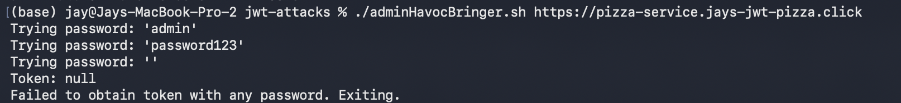   Attack Failed                                              |
| Corrections                     | Fix SQL injection in updating user data.                                                                            |

### Attack 5

| DOS            | Result                                                                                                   |
|----------------|----------------------------------------------------------------------------------------------------------|
| Date           | April 9, 2026                                                                                            |
| Target         | pizza.jays-jwt-pizza.click                                                                               |
| Classification | Insecure Design                                                                                          |
| Severity       | 3                                                                                                        |
| Description    | Makes a bunch of factory API calls to generate huge latency. Also can just break with regular DOS stuff. |
| Images         | 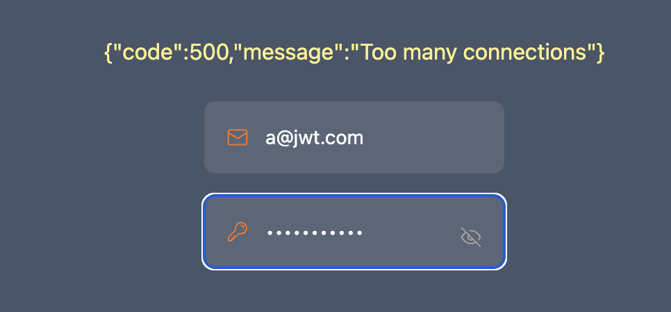   Yeah we broke                                                      |
| Corrections    | Cap pizza purchases to 19. Or find a way to make factory calls in parts. Throttle requests.              |

## Peer Attacks

### Attack 1: JWT Cracker

| JWT Cracker    | Result                                                                                 |
|----------------|----------------------------------------------------------------------------------------|
| Date           | April 9, 2026                                                                          |
| Target         | Authtoken from https://pizza.jays-jwt-pizza.click/                                     |
| Classification | Cryptographic Failure                                                                  |
| Severity       | 0 - Unsuccessful                                                                       |
| Description    | Hashcracker dictionary attack on JWT secret                                            |
| Images         | 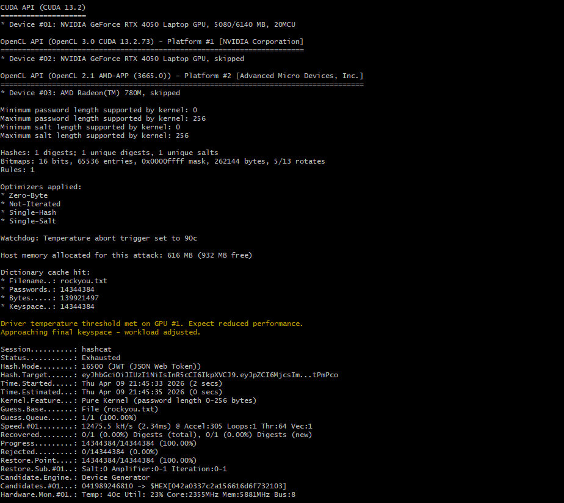 Dictionary exhausted |
| Corrections    | None needed. Already using secure JWT secret.                                          |

### Attack 2: Reflection XSS

| XSS            | Result                                                                                  |
|----------------|-----------------------------------------------------------------------------------------|
| Date           | April 9, 2026                                                                           |
| Target         | https://pizza.jays-jwt-pizza.click/                                                     |
| Classification | Injection                                                                               |
| Severity       | 0 - Unsuccessful                                                                        |
| Description    | checks to see if User name field is vulnerable to XSS                                   |
| Images         | 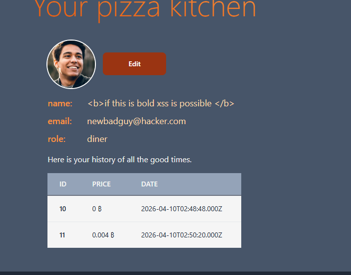 HTML tags were printed as plain text |
| Corrections    | None needed. Already secure.                                                            |

### Attack 3: User Email Collision

| User Email Collision | Result                                                                  |
|----------------------|-------------------------------------------------------------------------|
| Date                 | April 9, 2026                                                           |
| Target               | https://pizza-service.jays-jwt-pizza.click/                             |
| Classification       | Security Misconfiguration                                               |
| Severity             | 0 - Unsuccessful                                                        |
| Description          | Reregister user to share user email (login collision)                   |
| Images               | 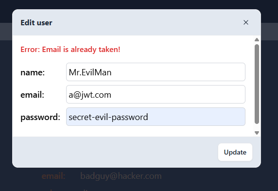  Rename prevented |
| Corrections          | None needed. Already secure.                                            |

### Attack 4: SQL Injection

| SQL Injection  | Result                                                                                                 |
|----------------|--------------------------------------------------------------------------------------------------------|
| Date           | April 9, 2026                                                                                          |
| Target         | https://pizza-service.jays-jwt-pizza.click/                                                            |
| Classification | Injection                                                                                              |
| Severity       | 0 - Unsuccessful                                                                                       |
| Description    | Renames user to "Bobby Pizza Tables"                                                                   |
| Images         | 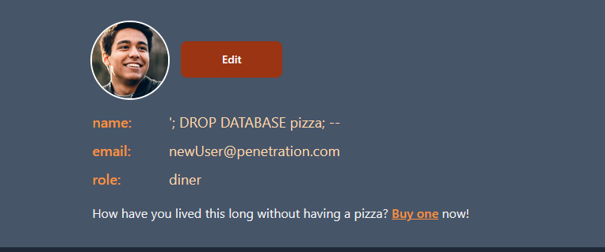 User data successfully retrieved after refresh |
| Corrections    | None needed. Already secure.                                                                           |

### Attack 5: Bad Pizza Orders

| Bad Pizza Orders | Result                                                                  |
|------------------|-------------------------------------------------------------------------|
| Date             | April 9, 2026                                                           |
| Target           | https://pizza-service.jays-jwt-pizza.click/                             |
| Classification   | Insecure Design                                                         |
| Severity         | 3 - High (with critical financial impact)                               |
| Description      | Makes HTTP service requests with bad pizza                              |
| Images           | 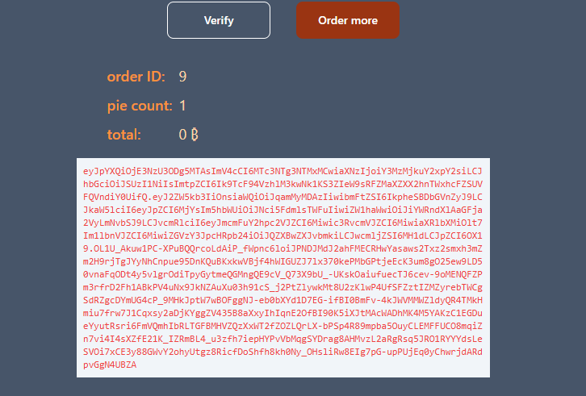 Pizzas can be free! |
| Corrections      | Verify that pizza orders match menu items                               |

# Attacks on Ethan

## Self Attacks

### Attack 1: JWT Cracker

| JWT Cracker    | Result                                                                                                                                                                       |
|----------------|------------------------------------------------------------------------------------------------------------------------------------------------------------------------------|
| Date           | April 8, 2026                                                                                                                                                                |
| Target         | Authtoken from https://pizza-service.329ethanr.click/                                                                                                                        |
| Classification | Cryptographic Failure                                                                                                                                                        |
| Severity       | 1 (Potential 3) - Low: No effect alone, but if coupled with SQL injection, could be used to bypass login (though a SQL injection alone could do equally catastrophic damage) |
| Description    | Hashcracker dictionary attack on JWT secret                                                                                                                                  |
| Images         | 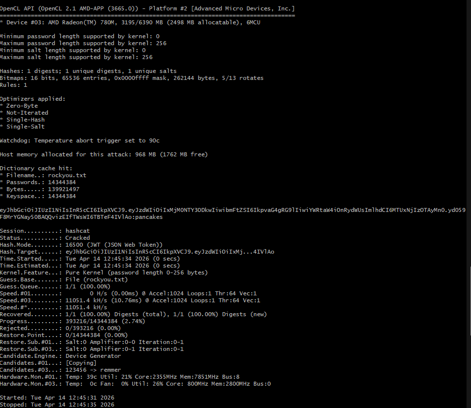 Secret extracted (pancakes)                                                                                    |
| Corrections    | Switch to secure JWT secret (done!)                                                                                                                                          |

### Attack 2: Reflection XSS

| XSS            | Result                                                                              |
|----------------|-------------------------------------------------------------------------------------|
| Date           | April 8, 2026                                                                       |
| Target         | https://pizza.329ethanr.click/                                                      |
| Classification | Injection                                                                           |
| Severity       | 0 - Unsuccessful                                                                    |
| Description    | checks to see if User name field is vulnerable to XSS                               |
| Images         |  HTML tags rendered as plain text |
| Corrections    | None needed. Already secure.                                                        |

### Attack 3: User Email Collision

| User Email Collision | Result                                                                                             |
|----------------------|----------------------------------------------------------------------------------------------------|
| Date                 | April 8, 2026                                                                                      |
| Target               | https://pizza-service.329ethanr.click/                                                             |
| Classification       | Security Misconfiguration                                                                          |
| Severity             | 0 - Unsuccessful                                                                                   |
| Description          | Reregister user to share user email (login collision)                                              |
| Images               | 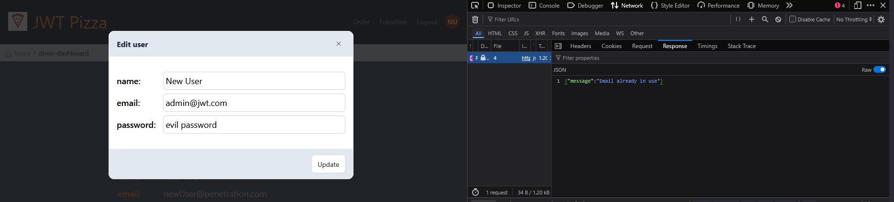  Rename prevented (could use UI though) |
| Corrections          | None needed. Already secure.                                                                       |

### Attack 4: SQL Injection

| SQL Injection  | Result                                                                                                   |
|----------------|----------------------------------------------------------------------------------------------------------|
| Date           | April 8, 2026                                                                                            |
| Target         | https://pizza-service.329ethanr.click/                                                                   |
| Classification | Injection                                                                                                |
| Severity       | 0 - Unsuccessful                                                                                         |
| Description    | Renames user to "Bobby Pizza Tables"                                                                     |
| Images         |    User data successfully retrieved after refresh |
| Corrections    | None needed. Already secure.                                                                             |

### Attack 5: Bad Pizza Orders

| Bad Pizza Orders | Result                                                                                                                                                       |
|------------------|--------------------------------------------------------------------------------------------------------------------------------------------------------------|
| Date             | April 9, 2026                                                                                                                                                |
| Target           | https://pizza-service.329ethanr.click/                                                                                                                       |
| Classification   | Insecure Design                                                                                                                                              |
| Severity         | 4 - Critical                                                                                                                                                 |
| Description      | Makes HTTP service requests with bad pizza                                                                                                                   |
| Images           | 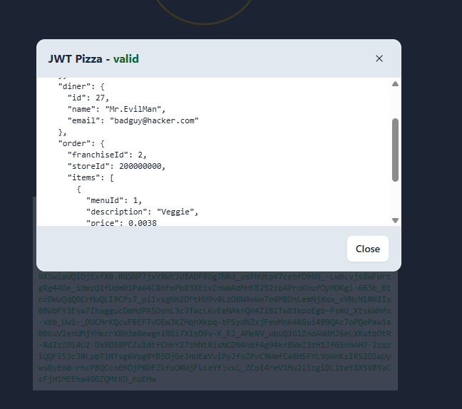  Orders can be routed to nonexistent stored                                                              |
| Corrections      | Verify that stores and franchises exist. Also, consider adding encrypted signature from website to reduce likelihood of non-website service traffic. (done!) |

## Peer Attacks

### Attack 1

| Franchise Killer | Result                                                    |
|------------------|-----------------------------------------------------------|
| Date             | April 6, 2026                                             |
| Target           | https://pizza.329ethanr.click/                            |
| Classification   | Broken Access Control                                     |
| Severity         | 0                                                         |
| Description      | Removes all franchises removing the ability to buy pizzas |
| Images           |   |
| Corrections      | Check auth before allowing franchise deletion.            |

### Attack 2

| Admin Havoc    | Result                                                                                                              |
|----------------|---------------------------------------------------------------------------------------------------------------------|
| Date           | April 6, 2026                                                                                                       |
| Target         | https://pizza.329ethanr.click/                                                                                      |
| Classification | Security Misconfiguration                                                                                           |
| Severity       | 0                                                                                                                   |
| Description    | Removes all franchises removing the ability to buy pizzas. Also steals all users information and deletes all users. |
| Images         |                                                                       |
| Corrections    | Change default admin password. Even better: have secure admin password.                                             |

### Attack 3

| Nasty SQL      | Result                                                                                                                              |
|----------------|-------------------------------------------------------------------------------------------------------------------------------------|
| Date           | April 6, 2026                                                                                                                       |
| Target         | https://pizza.329ethanr.click/                                                                                                      |
| Classification | Injection                                                                                                                           |
| Severity       | 0                                                                                                                                   |
| Description    | Steals all user's emails and the original hashed passwords. Then it sets everyone's password to the latest special secret password. |
| Images         | 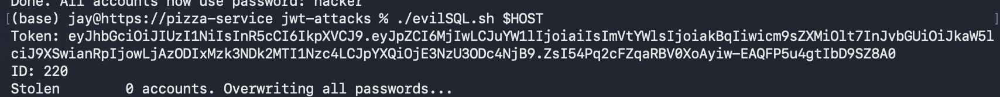                                                                                   |
| Corrections    | Fix SQL injection in updating user data.                                                                                            |

### Attack 4

| Empty Password/common passwords | Result                                                                                                              |
|---------------------------------|---------------------------------------------------------------------------------------------------------------------|
| Date                            | April 9, 2026                                                                                                       |
| Target                          | https://pizza.329ethanr.click/                                                                                      |
| Classification                  | Security Misconfiguraition                                                                                          |
| Severity                        | 0                                                                                                                   |
| Description                     | Removes all franchises removing the ability to buy pizzas. Also steals all users information and deletes all users. |
| Images                          |                                                                          |
| Corrections                     | Fix SQL injection in updating user data.                                                                            |

### Attack 5

| DOS            | Result                                                                                                   |
|----------------|----------------------------------------------------------------------------------------------------------|
| Date           | April 9, 2026                                                                                            |
| Target         | https://pizza.329ethanr.click/                                                                           |
| Classification | Insecure Design                                                                                          |
| Severity       | 0                                                                                                        |
| Description    | Makes a bunch of factory API calls to generate huge latency. Also can just break with regular DOS stuff. |
| Images         |    Yeah we broke                                                      |
| Corrections    | Cap pizza purchases to 19. Or find a way to make factory calls in parts. Throttle requests.              |

# Learning Summary

